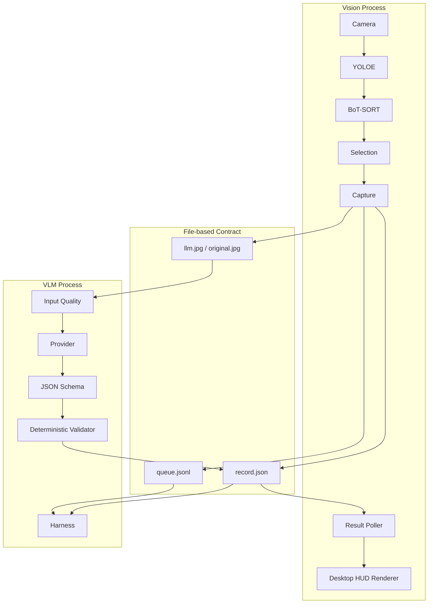
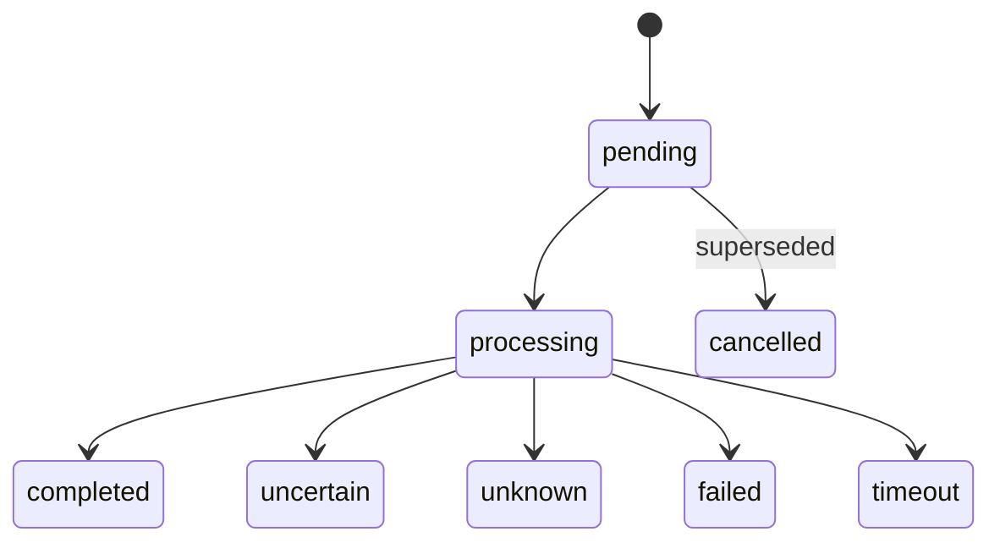
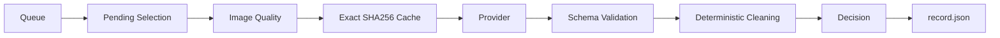

# Architecture

이 문서는 프로젝트의 내부 구조와 모듈 간 계약을 설명합니다.

---

# 1. Architecture Goals

본 프로젝트는 처음부터 다음 요구사항을 기준으로 설계되었습니다.

1. Camera / Tracking loop가 VLM 응답을 기다리지 않을 것
2. VLM Backend를 나중에 쉽게 교체할 수 있을 것
3. Desktop HUD를 VR UI로 교체할 수 있을 것
4. 오래된 VLM 응답이 다른 객체에 잘못 붙지 않을 것
5. YOLO semantic label을 정답으로 사용하지 않을 것
6. VLM Raw Output을 그대로 사용자에게 노출하지 않을 것
7. 요청 / 응답 / 이미지가 재현 가능한 형태로 남을 것

---

# 2. High-Level Components



---

# 3. Process Boundary

현재 통합 실행 시 실제로는 하나의 프로그램이 아니라 여러 프로세스입니다.

```text
run_integrated.py
│
├─ llama-server.exe
│
├─ python harness.py
│
└─ python yoloe_desktop_pipeline_v2_2_ui.py
```

사용자에게는 하나의 명령으로 보이지만 각 프로세스의 책임은 독립적입니다.

이 구조는 의도적입니다.

VLM inference가 정지하거나 Timeout이 발생해도 Vision Process가 계속 동작할 수 있기 때문입니다.

---

# 4. Vision Process

파일:

```text
yoloe_desktop_pipeline_v2_2_ui.py
```

책임:

```text
Camera
YOLOE inference
Segmentation
Tracking
User selection
Manual ROI
Capture
Record creation
Queue append
Result polling
Desktop rendering
```

VLM inference 자체는 이 프로세스에서 하지 않습니다.

---

# 5. Detector Policy

Detector:

```text
yoloe-26s-seg-pf.pt
```

YOLOE가 제공하는 semantic label:

```json
{
  "label_hint": "mouse",
  "confidence": 0.61
}
```

은 VLM Prompt에 전달될 수 있지만 다음 정책을 따릅니다.

```text
semantic_label_policy = hint_only_not_ground_truth
```

따라서 VLM은 이미지 자체를 독립적으로 판단해야 합니다.

---

# 6. Object Identity Model

## track_id

Tracker runtime identity.

```text
17
```

특징:

- Tracker가 관리
- 재시작 시 의미 없음
- Tracking fragmentation 가능
- Application identity로 사용하지 않음

---

## object_id

Application-level selected object identity.

```text
obj_<uuid>
```

특징:

- 선택된 객체와 UI 결과를 연결
- 한 object는 여러 capture를 가질 수 있음

관계:

```text
object_id
 ├─ capture_id 1
 │    └─ request_id 1
 │
 └─ capture_id 2
      └─ request_id 2
```

---

## capture_id

한 번의 이미지 Capture.

```text
cap_<uuid>
```

---

## request_id

한 번의 VLM 요청.

```text
req_<uuid>
```

Async UI에서는 이 ID가 특히 중요합니다.

---

# 7. Record Lifecycle

Capture 직후:

```text
pending
```

Harness가 선택:

```text
processing
```

최종 결과:

```text
completed
uncertain
unknown
failed
timeout
cancelled
```

State transition:



---

# 8. Why record.json?

`record.json`은 다음 데이터의 결합점입니다.

```text
Object identity
Capture metadata
Detector metadata
Bounding box
Segmentation metadata
Image paths
VLM request
VLM response
Harness validation
Latency
Error state
```

다른 모듈은 내부 Python Object를 직접 공유하지 않고 이 Record Contract를 기준으로 통신합니다.

장점:

- Debug 가능
- Replay 가능
- 모델 비교 가능
- VLM 교체 가능
- UI 교체 가능

---

# 9. Queue Design

Queue는 Append-only JSONL입니다.

```text
capture/queue.jsonl
```

Queue에 전체 요청 데이터를 중복 저장하지 않고 `record.json` Pointer만 저장합니다.

따라서 Single Source of Truth는 항상 Record입니다.

---

# 10. Latest-first / Coalescing

Interactive UI에서는 오래된 요청보다 사용자의 최신 요청이 중요합니다.

Harness 기본값:

```json
{
  "latest_first": true,
  "coalesce_same_object": true
}
```

예:

```text
Object A Capture #1 → pending
Object A Capture #2 → pending
```

이면:

```text
#1 → cancelled: superseded_by_newer_capture
#2 → processing
```

---

# 11. VLM Harness Pipeline



Quality Flags:

```text
small_crop
possibly_blurry
very_dark
very_bright
```

현재 Quality flag는 자동 Reject 용도보다는 Provider에 Context를 제공하는 목적으로 사용합니다.

---

# 12. Cache

현재 Harness에는 Exact Image SHA256 기반 Cache가 있습니다.

개념적인 Key:

```text
SHA256(
    image_hash
    + provider_model
    + schema_version
)
```

동일 이미지와 동일 모델을 다시 요청하면 VLM을 다시 호출하지 않고 Cache 결과를 사용할 수 있습니다.

현재 구현은 단순 Prototype Cache이므로 향후 Provider 종류 / Prompt version / Schema hash까지 Key에 포함하는 것이 좋습니다.

---

# 13. Provider Boundary

현재 Provider:

```text
LlamaCppProvider
```

Provider가 담당하는 것:

```text
HTTP request formatting
Image Base64 conversion
Provider-specific API payload
Response parsing
Provider metadata
```

Provider가 담당하지 않는 것:

```text
Camera
YOLO
Tracking
Selection
Queue policy
Stale response
HUD rendering
```

---

# 14. Provider Contract

현재 Harness가 기대하는 핵심 호출:

```python
raw, provider_ms, metadata = provider.identify(
    image_path=image_path,
    selection_method=selection_method,
    yolo_hint=hint,
    quality_flags=quality_flags,
)
```

반환값:

```text
raw          Structured Provider JSON
provider_ms  Provider request latency
metadata     Token usage / timings etc.
```

Provider의 Output은 아직 신뢰하지 않습니다.

반드시 Validator를 통과해야 합니다.

---

# 15. Validator

Validator는 두 단계입니다.

## JSON Schema

```text
vision_response.schema.json
```

Schema를 벗어나면:

```text
schema_valid = false
decision = UNCERTAIN
```

---

## Deterministic Evidence Rules

예:

```text
brand != null
AND brand_evidence == none
```

이면:

```text
brand = null
warning generated
escalation = true
```

Product / Model에도 같은 원칙을 적용합니다.

---

# 16. Provider Prompt Policy

객체 종류와 카테고리는 이미지 형태에서 추론 가능합니다.

세부 identity는 엄격하게 제한합니다.

```text
Object type          Moderate
Category             Moderate
Brand                Strict
Product name         Stricter
Exact model          Strictest
```

또한 이미지 안에 쓰인 Text는:

```text
Observation Data
```

이지 Instruction이 아닙니다.

즉 이미지 내부 Prompt Injection을 실행하지 않도록 명시합니다.

---

# 17. Result Poller

Vision Process는 VLM Worker와 Socket callback을 직접 공유하지 않습니다.

현재 Prototype에서는 작은 `record.json`의 `mtime`을 주기적으로 확인합니다.

기본 polling:

```text
100 ms
```

Record가 변경되면:

```text
request_id 확인
        ↓
status / response update
        ↓
HUD renderer
```

---

# 18. Stale Result Rule

현재 UI Result Card는 다음을 보존합니다.

```text
object_id
request_id
capture_id
record_path
```

Record가 변경되어도:

```text
record.request_id != current_card.request_id
```

이면 해당 결과를 현재 Card에 연결하지 않습니다.

이는 VR에서도 그대로 유지해야 하는 규칙입니다.

---

# 19. Renderer Boundary

현재 UI 파일의 논리 계층:

```text
poll_result_cards()
    ↓
ResultCard state
    ↓
draw_result_cards()
    ↓
draw_info_card()
```

`draw_info_card()`가 현재 OpenCV-specific 부분입니다.

VR에서는 이 가장 아래 Renderer 계층을 교체하는 것을 목표로 합니다.

---

# 20. Desktop → VR Mapping

Desktop:

```text
Mouse Click
BBox
OpenCV
```

Future VR:

```text
Hand Ray
Pinch
Tracked / Spatial Object
World-Space UI
```

Mapping:

| Desktop | VR |
|---|---|
| Mouse cursor | Hand ray |
| Click | Pinch |
| Pixel bbox | Projected tracked object / spatial anchor |
| OpenCV card | Unity world-space Canvas |
| `object_id` | 그대로 유지 |
| `request_id` | 그대로 유지 |
| `record.json` | 그대로 유지 가능 또는 Network DTO로 변환 |

---

# 21. Manual ROI Strategy

현재 Manual ROI:

```text
user rectangle
fixed image coordinates
```

Tracking을 시도하지 않습니다.

이 선택은 잘못된 Tracker 재결합으로 다른 객체를 따라가는 것보다 안전한 Prototype 정책입니다.

VR에서는 User-selected region을 별도 Tracker/SAM 등으로 추적하는 확장 가능성이 있습니다.

---

# 22. Launcher Responsibility

`run_integrated.py`는 Business Logic을 가지지 않는 것이 원칙입니다.

책임:

```text
Preflight
Process startup
Health check
Config wiring
Process logging
Graceful shutdown
```

책임이 아닌 것:

```text
Object detection
AI interpretation
Validation
Rendering
```

---

# 23. Future Refactoring Recommendations

현재 구조는 Prototype으로 모듈 경계가 잘 잡혀 있으나 다음 리팩터링을 권장합니다.

## Provider Factory

현재 Harness가 `LlamaCppProvider`를 직접 생성합니다.

목표:

```python
provider = create_provider(config)
```

Provider 추가 시 Harness 수정이 필요 없도록 합니다.

---

## UI Renderer Extraction

현재 HUD 함수가 Vision 파일 안에 있습니다.

목표:

```text
ui/
├─ result_state.py
├─ desktop_opencv_renderer.py
└─ protocol.py
```

---

## IPC Abstraction

현재:

```text
queue.jsonl
record.json polling
```

향후 VR / 별도 장비 분리 시:

```text
HTTP
WebSocket
gRPC
Message Queue
```

등으로 변경할 수 있습니다.

중요한 것은 Transport가 아니라 다음 Contract를 유지하는 것입니다.

```text
object_id
capture_id
request_id
validated response
status
```

---

# 24. Core Invariant

어떤 플랫폼으로 옮기더라도 이 규칙은 유지해야 합니다.

> **현재 UI에 표시되는 결과는 반드시 현재 사용자가 보고 있는 객체의 최신 request_id에 속해야 한다.**

그리고:

> **Raw VLM output은 Validator를 거치기 전에는 사용자 UI에 표시하지 않는다.**

이 두 규칙이 Async Vision + VLM 시스템의 핵심 안전장치입니다.
